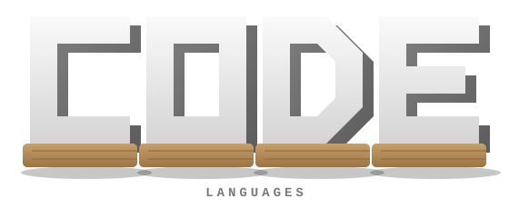
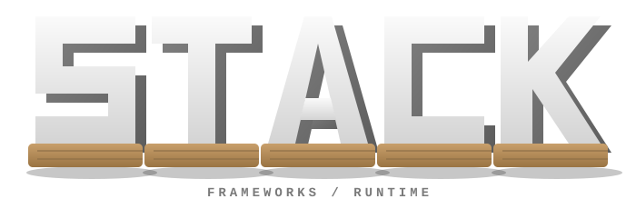
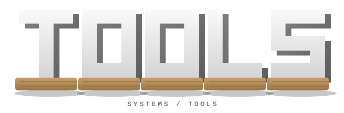
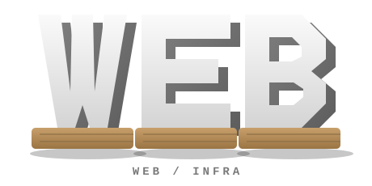
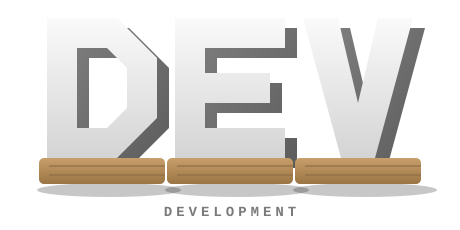
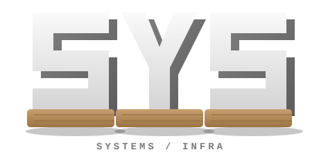
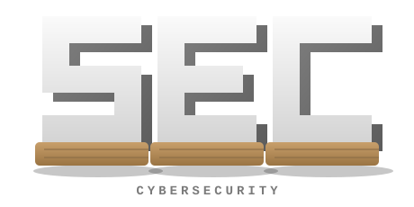
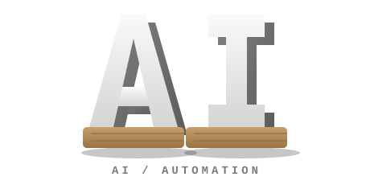

<div align="center">
  
</div>

<div align="center">
  
</div>

<br>

<p align="center">
  Developer focused on clean systems, automation and AI-assisted workflows.
</p>

<p align="center">
  
  
  
  
</p>

---

## `01` — About

I build, test and refine digital projects with an emphasis on clean interfaces, automation and modern tooling. AI-assisted workflows are part of how I research, prototype, debug and ship — from early architecture decisions to the final deployment.

<table align="center">
<tr>
<td width="33%" align="center">

**3+**
<br>
years tinkering with dev & infra

</td>
<td width="33%" align="center">

**AI-native**
<br>
workflow, top to bottom

</td>
<td width="33%" align="center">

**Open**
<br>
to collab & new projects

</td>
</tr>
</table>

---

## `02` — Tech stack

<table width="100%">
<tr>
<td width="50%" valign="top" align="center">


<br><br>


</td>
<td width="50%" valign="top" align="center">


<br><br>


</td>
</tr>
<tr>
<td width="50%" valign="top" align="center">


<br><br>


</td>
<td width="50%" valign="top" align="center">


<br><br>


</td>
</tr>
</table>

---

## `03` — AI tools

<div align="center">


</div>

<p align="center"><i>AI is part of my workflow for ideation, code review, debugging, documentation and rapid prototyping.</i></p>

---

## `04` — What I work on

<table width="100%">
<tr>
<td width="50%" valign="top">

<p align="center">
  
</p>

- JavaScript / TypeScript projects
- Node.js applications and bots
- Automation scripts
- APIs and backend logic
- Web interfaces

</td>
<td width="50%" valign="top">

<p align="center">
  
</p>

- Linux / Ubuntu servers
- VPS deployment
- Nginx and reverse proxy
- Docker environments
- Git / GitHub workflows

</td>
</tr>
<tr>
<td width="50%" valign="top">

<p align="center">
  
</p>

- Security-oriented tooling
- System hardening basics
- Networking fundamentals
- Testing and technical research

</td>
<td width="50%" valign="top">

<p align="center">
  
</p>

- AI-assisted development
- Prompt-based workflows
- Rapid prototyping
- Documentation assistance
- Productivity automation

</td>
</tr>
</table>

---

## `05` — Project — Aluna

<div align="center">
  <a href="https://discord.gg/aluna">
    
  </a>
</div>

<p align="center"><i>Aluna is my Discord community for cybersecurity and development — security research, tooling, dev help and collaboration.</i></p>

```txt
Aluna       Cybersecurity & development community
Focus       Security research, tooling, dev support
Invite      discord.gg/aluna
```

---

## `06` — Currently

```txt
Learning     Deepening cybersecurity & networking fundamentals
Building     Automation tooling around AI-assisted workflows
Exploring    Self-hosted infrastructure & reverse proxy setups
```

---

## `07` — GitHub statistics

<div align="center">
  
</div>

<div align="center">
  
  
  
</div>

<div align="center">
  
</div>

---

## `08` — Contact

<div align="center">
  
  <a href="https://discord.gg/aluna">
    
  </a>
</div>

---

<div align="center">
  <sub>Building, learning, improving.</sub>
</div>
